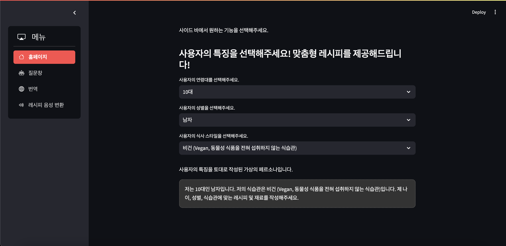

# Recipe_Generator by RAG with TTS   

## 프로젝트 개요   
본 프로젝트는 LLM을 활용하여 RAG를 구현하여 레시피 생성 기능, GoogleAPI를 활용하여 Translate, TTS를 구현하여 웹사이트 베포를 하는 프로젝트입니다.

# Streamlit을 활용하여 웹사이트 프로로토타입 생성
- RGRG 웹사이트 메인 홈페이지 화면 - 사용자의 특징을 선택하여 가상의 페르소나 생성


- RGRG 웹사이트 텍스트(레시피) 생성 화면 - RAG에서 사용할 문서를 왼쪽 사이드에서 업로드 후 "요리의 레시피를 알려주세요."라는 프롬포트 작성 후 "검색" 버튼 클릭


- RGRG 웹사이트 생성된 텍스트 번역 화면 - 앞서 생성된 텍스트를 원하는 언어로 번역, 원하는 언어 선택 후 "번역" 버튼 클릭


- RGRG 웹사이트 생성된 텍스트 음성 변환 화면 - 앞서 생성된 텍스트를 원하는 언어로 음성 변환, 원하는 언어 및 음성 속도 선택 후 "Generate Audio" 버튼 클릭


## 프로젝트 구조
```
.
├── Crawling                
│   ├── recipe_crawling.py     
│   ├── breakfast.txt
│   ├── lunch.txt    
│   └── dinner.txt    
├── Data
│   ├── one_recipe
│   │   ├── breakfast_recipes.json
│   │   ├── lunch_recipes.json
│   │   ├── dinner_recipes.json
│   │   └── merged_recipes.json  
│   └── ten_recipe
│       ├── pdf_convert.ipynb        
│       ├── flatten_breakfast_recipes.json
│       ├── flatten_lunch_recipes.json
│       ├── flatten_dinner_recipes.json
│       ├── new_breakfast_recipes.json
│       ├── new_lunch_recipes.json
│       ├── new_dinner_recipes.json
│       └── new_merged_recipes.json  
├── Fine_Tuning_Data    
│   ├── one_recipe
│   │    ├──demo_prompts.json 
│   │    └── instruction_data.json
│   └── ten_recipe
│       └── demo_prompts_2.json
├── PDF                     
│   └── 
├── README.md               
├── Setup
│   ├── RGRG_test.ipynb
│   ├── one_recipe
│   │   ├── create_prompt.ipynb
│   │   ├── merge_recipes.ipynb
│   │   ├── recipe_crawling.ipynb
│   └── src           
│       ├── finetuning.py       
│       ├── reciep_merger.py    
│       ├── prompt_gen.py
│       ├── LoRA.py     
│       └── quantization.py
└── Web
    ├── __pycache__
    ├── recipe_book.pdf
    ├── app.py
    ├── audio.py
    ├── homepage.py
    ├── recipe.py
    ├── translate.py
    └── requirements.txt   
    
```
<br>
<br>
---

> `Project Owner : Torijune`
